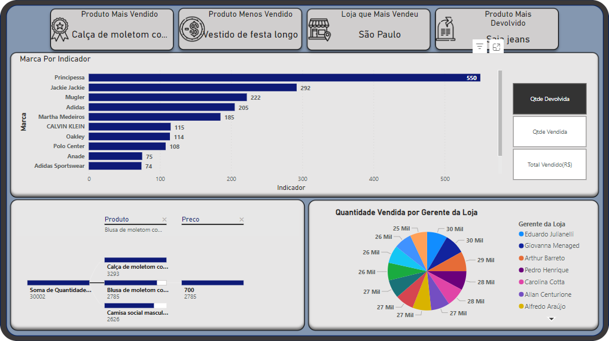

<h1>Análise de Dados e Elaboração de Dashboards</h1>
<h3>Estudos de caso em que foi feita a análise do banco de dados(csv) e a criação de relatórios para atender à situação problema. São três casos:</h3>
<h2>Caso 1: SóVai</h2>
<h3>Caso de estudo:</h3>

"A SÓ VAI, loja especializada em moda, famosa pelo estilo único, está necessitada para a criação de um relatório de vendas. Sua função agora é fornecer a ela essa análise com as seguintes relações:"

<ul>
  <li>Produto mais vendido</li>
  <li>Produto menos vendido</li>
  <li>Loja  que mais vendeu</li>
  <li>Produto mais devolvido</li>
  <li>Marca por indicador (Devoluções por marca, devoluções por marca e vendas por marca)</li>
  <li>Quantidade vendida por produto e preço</li>
  <li>Quantidade vendida por gerente da loja</li>
</ul>

Relatório: https://abrir.link/cEr0D

<h2>Caso 2: Implementos Agrícolas Senai - Produção</h2>
<h3>Caso de estudo:</h3>

"Você, que faz parte do time de gestão na Implementos Agrícolas Senai, foi incumbido da criação do relatório de produção contendo os dados de todo o período de 2021. Este relatório tem, necessariamente, que possuir as métricas:"

<ul>
  <li>Quantidade Produzida</li>
  <li>Quantidade Teórica (Total de Horas * Peças Hora)</li>
  <li>Quantidade Rejeitada</li>
  <li>Total de Horas (Hora Final – Hora Inicial)</li>
  <li>Horas Produtivas – Horas em que a produção está fluindo</li>
  <li>Horas Paradas – Tempo em que a produção está parada</li>
  <li>Disponibilidade – Horas Produtivas / Total de Horas</li>
  <li>Produtividade – Quantidade Produzida / Quantidade Teórica</li>
  <li>Qualidade – Quantidade Produzida / Total Peças (Produzidas + Rejeitadas)</li>
  <li>OEE (Eficácia Geral do Equipamento) – Disponibilidade * Produtividade * Qualidade</li>
</ul>

Relatório: https://abrir.link/dE0Qz

<h2>Caso 3: Implementos Agrícolas Senai - Funcionários</h2>
<h3>Caso de estudo:</h3>

"Você, que faz parte do time de gestão na Implementos Agrícolas Senai, foi incumbido da criação do relatório de produção contendo os dados de todo o período de 2021. Este relatório tem, necessariamente, que possuir as métricas:"

 <ul>
   <li>Funcionário que Mais Produziu</li>
   <li>Funcionário que Menos Produziu</li>
   <li>Operador que Mais Rejeitou Peças</li>
   <li>Média de Peças por Minuto</li>
   <li>Operador por Quantidade Produzida</li>
   <li>Quantidade Produzida por Mês</li>
   <li>Quantidade Rejeitada por Operador</li>
   <li>Quantidade Rejeitada por Mês</li>
 </ul>

Relatório: https://abrir.link/97kjT

 

 

<i>Esses casos foram desenvolvidos ao longo do curso de Power BI(Senai)</i>

